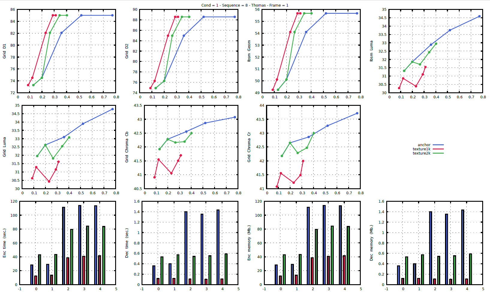
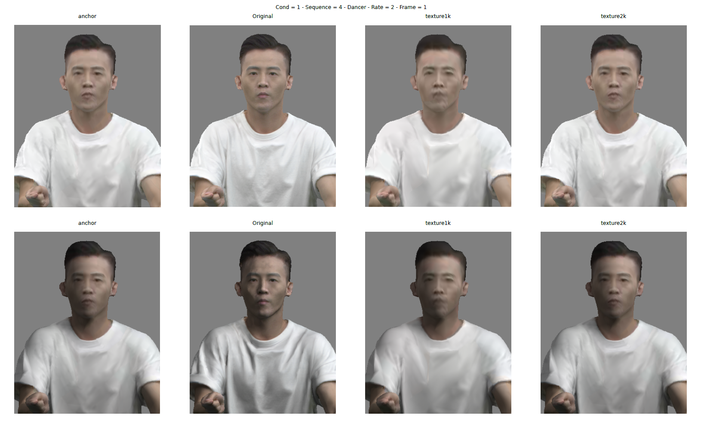
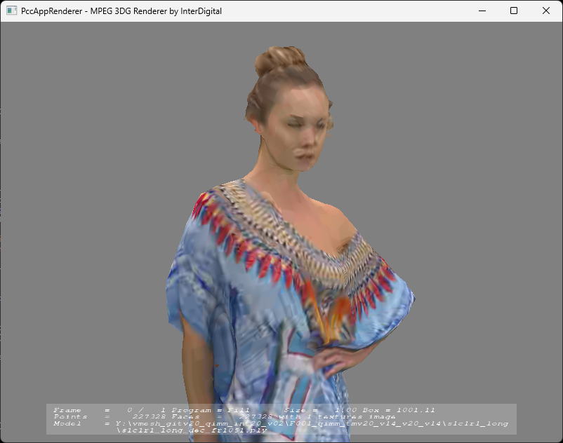

<!--- 
   ################################################################# 
   # File automatically generated by ./doc/scripts/build_readme.sh # 
   # script.                                                       # 
   ################################################################# 
   # Do not edit manually this file                                # 
   ################################################################# 
   # Please update the following files if needed:                  # 
   #  - doc/readme/about.md                                        # 
   #  - doc/readme/clone.md                                        # 
   #  - doc/readme/build.md                                        # 
   #  - doc/readme/dependencies.md                                 # 
   #  - doc/readme/architecture.md                                 # 
   #  - doc/readme/usage.md                                        # 
   # and execute script:                                           # 
   #  - ./doc/scripts/build_readme.sh                              # 
   ################################################################# 
 --> 


<!--- General Information  --->
# General Information

Reference software is being made available to provide a reference implementation of the video-based dynamic mesh coding standard being developed by MPEG-3DG (ISO/IEC SC29 WG7).

One of the main goals of the reference software is to provide a basis upon which to conduct experiments in order to determine which coding tools provide desired coding performance. It is not meant to be a particularly efficient implementation of anything, and one may notice its apparent unsuitability for a particular use. It should not be construed to be a reflection of how complex a production-quality implementation of a future standard would be.

This document aims to provide guidance on the usage of the reference software. It is widely suspected to be incomplete and suggestions for improvements are welcome. Such suggestions and general inquiries may be sent to the general MPEG 3DG email reflector at <mpeg-3dgc@gti.ssr.upm.es> (registration required).


<!--- Clone  --->
# Obtaining the software

The authoritative location of the software is the following git repository: <https://github.com/MPEGGroup/mpeg-vdmc-tm>  

Each released version may be identified by a version control system tag in the form: `v14.0`

An example:

```console
$ git clone \
   https://github.com/MPEGGroup/mpeg-vdmc-tm.git
$ cd mpeg-vmesh-tm
$ git checkout v14.0
```

> It is strongly advised to obtain the software using the version control
> system rather than to download a zip (or other archive) of a particular
> release.  The build system uses the version control system to accurately  
> identify the version being built.


<!--- Building  --->
# Building 

## Building script

A bash script is provided to facilitate the building operations. 

To build V-DMC test model softwares with this script please use the following command line:

```console
$ ./build.sh
$ ./build.sh --help
./build.sh mpeg-vmesh-tm building script:

    Usage:
       -h|--help    : Display this information.
       -o|--ouptut  : Output build directory.
       -n|--ninja   : Use Ninja.
       --debug      : Build in debug mode.
       --release    : Build in release mode.
       --doc        : Build documentation (latex and pdflatex requiered).
       --format     : Format source code.
       --tidy       : Check source code with clang-tidy.
       --cppcheck   : Check source code with cppcheck.
       --test       : Build unit tests.
       --meshType=* : Define template mesh type: float or double.
       --codeCodecId: Code codec id used in the bitstream.

    Examples:
      ../build.sh
      ../build.sh --debug
      ../build.sh --doc
      ../build.sh --format
```` 

Another script could be used to clean the current solutions with the following command lines:

```console
$ ./clear.sh      # Remove ./build/ sub-folder.
$ ./clear.sh all  # Remove all cloned dependencies.
```

## Build manually

Standard CMake build commands can be used to build the 
software depending on the system you used.

### OSX
```console
$ mkdir build
$ cmake -S. -Bbuild -G Xcode
$ xcodebuild -project build/vmesh.xcodeproj -configuration Debug
```

### Linux
```console
$ mkdir build
$ cmake -DCMAKE_BUILD_TYPE=Release -S. -Bbuild/Release
$ cmake --build ./build/Release --config Release --parallel 12
```

### Windows
```console
$ md build
$ cmake -DCMAKE_BUILD_TYPE=Release -S. -Bbuild/Release
$ cmake --build ./build/Release --config Release --parallel 12
```


<!--- 
   ############################################################### 
   # File automatically generated by /e/LPY/doc/scripts/build_dependencies.sh # 
   # do not edit manually.                                       # 
   ############################################################### 
 --> 


## Dependencies


The V-DMC test model software uses several dependencies that are cloned and patched by the CMake building process. 

 These dependencies are: 


| **URL** | **Commit/tag** | 
|---|---| 
| [HM                  ](https:/vcgit.hhi.fraunhofer.de/jvet/HM.git                            ) | HM-16.21+SCM-8.8 | 
| [VVCSoftware_VTM     ](https:/vcgit.hhi.fraunhofer.de/jvet/VVCSoftware_VTM.git               ) | VTM-13.0 | 
<!--- Architecture  --->
# Architecture 

V-Mesh test model software is organized as shows in figure 1.


## Core libraries

The core codec processes are grouped into twenty one libraries:

- `bitstreamsCommon` containing the fundamental bitstream parsing and generation processes.
- `v3cBitstream` containing the bitstream parsing and generation processes for V3C.
- `vmeshCommon` containing the util objects and the processes shared by V-Mesh encoding and decoding processes.
- `vmeshEncoder` containing the V-Mesh encoding processes.
- `vmeshDecoder` containing the V-Mesh decoding processes.
- `vmeshConformance` containing the conformance verification processes.
- `acDisplacementBitstream` containing the bitstream parsing and generation processes for arithmetic coding of displacement.
- `acDisplacementCommon` containing the common processes for arithmetic coding of displacement.
- `acDisplacementEncoder` containing the arithmetic encoding processes of displacement.
- `acDisplacementDecoder` containing the arithmetic decoding processes of displacement.
- `atlasBitstream` containing the bitstream parsing and generation processes for atlas information.
- `atlasCommon` containing the common processes for atlas information.
- `atlasEncoder` containing the atlas information encoding processes.
- `atlasDecoder` containing the atlas information decoding processes.
- `basemeshBitstream` containing the bitstream parsing and generation processes for basemesh.
- `basemeshEncoder` containing the basemesh encoding processes.
- `basemeshDecoder` containing the basemesh decoding processes.
- `ebBitstream` containing the bitstream parsing and generation processes for Edge Breaker.
- `ebCommon` containing the processes shared by MPEG Edge Breaker (MEB) encoding and decoding processes.
- `ebEncoder` containing the MEB encoding processes.
- `ebDecoder` containing the MEB decoding processes.

## Wrapper libraries
 
To unify interfaces with external libraries used to encode/decode meshes, encode/decode/convert videos and compute metrics, wrapper libraries
have been created:

- `videoEncoder`: wrapper to HM encoder, VTM encoder;
- `videoDecoder`: wrapper to HM decoder, VTM decoder;
- `geometryEncoder`: wrapper to MEB encoder; 
- `geometryDecoder`: wrapper to MEB decoder;
- `colourConverter`: wrapper to HDRTools.

These libraries are based on a virtual object that can be derived to implement one specific interface with the external libraries. The source codes of the wrapper libraries are stored in the `source/wrapper/` sub-folder.

## Applications 

The source codes of V-Mesh applications are stored in the `source/app/` sub-folder. 

### Main applications

The two main application of the V-Mesh test model are: 

- `encode`: that can be used to encode mesh sequence to a V-Mesh bitstream.
- `decode`: that decode V-Mesh bitstream.
- `metric`: that can be used to evaluates V-mesh compression performance metrics.

The following section shows examples of the usage of these softwares.

### Wrapper applications

To evaluate the wrapper libraries specific applications have been created. These applications can be used to crosscheck the usage of the external applications. The source code of these applications are in `source/app/wrapper/` sub-folder: 

- `ebEncode`;
- `ebDecode`;
- `videoEncoder`;
- `videoDecoder`;
- `colourConverte`;
- `objToPlyConvert`;
- `dracoEncoder`;
- `dracoDecoder`;
- `checksum`;
- `baseMeshEncodeApp`;
- `baseMeshDecodeApp`;
- `atlasEncodeApp`;
- `atlasDecodeApp`;
- `acdEncodeApp`;
- `acdDecodeApp`.

### Unit test applications

To evaluate the source code and to guarantee an early regression detection, unit test application has been created. 

The unit test application is based on [Google Testing Framework](https://github.com/google/googletest). The source code of this software is stored in `source/app/unitTests/`. 
The list of the unit tests that are implemented can be logged with the following command line:

```console
$ ./build/Release/bin/unitTests --gtest_list_tests
draco.
  encode
  decode
metrics.
  compare
hm.
  disp
  disp2
  texture
colourConvert.
  hdrToolsUp
  hdrToolsDown
vmesh.
  all
```

The unit tests can be executed with:
```console
$ ./build/Release/bin/unitTests -v 0
... 
[       OK ] hm.texture (4770 ms)
[----------] 3 tests from hm (5595 ms total)

[----------] 2 tests from colourConvert
[ RUN      ] colourConvert.hdrToolsUp
[       OK ] colourConvert.hdrToolsUp (190 ms)
[ RUN      ] colourConvert.hdrToolsDown
[       OK ] colourConvert.hdrToolsDown (197 ms)
[----------] 2 tests from colourConvert (388 ms total)

[----------] 1 test from vmesh
[ RUN      ] vmesh.all
[       OK ] vmesh.all (49463 ms)
[----------] 1 test from vmesh (49463 ms total)

[----------] Global test environment tear-down
[==========] 9 tests from 5 test suites ran. (64516 ms total)
[  PASSED  ] 9 tests.
```

Note: it's greatly recommended to execute the unit test application before each submission in the repository.

<!--- Usage  --->
# Usage

## Encode 

The encode command line is the following one: 

```console
$ ./build/Release/bin/encode \
    --config=./generatedConfigFiles/s3c1r3_bask/encoder.cfg \
    --frameCount=1 \
    --compressed=s3c1r3_bask.vmesh 
```

## Decode

The decode can be executed with:

```console
./build/Release/bin/decode \
  --config=./generatedConfigFiles/s3c1r3_bask/decoder.cfg \
  --compressed=s3c1r3_bask.vmesh \
  --decMesh=s3c1r3_bask_%04d_dec.obj \
  --decTex=s3c1r3_bask_%04d_dec.png \
  --decMat=s3c1r3_bask_%04d_dec.mtl \
```

## Runtime configuration and configuration files

To generate the configuration files (conmon test conditions) according to your system paths, the following action must be made: 

1. copy and edit `cfg/cfg-site-default.yaml` as `cfg/cfg-site.yaml`,
   the paths for the binaries, sequence prefix, and the external
   tool configuration prefix;

2. run the ./scripts/gen-cfg.sh' script:

```console
$ ./scripts/gen-cfg.sh \
    --cfgdir=./cfg/ \
    --outdir=/path/to/generated/cfgfiles
```

This operation can be executed with script './scripts/create_configuration_files.sh' and in this case the file 'cfg/cfg-site.yaml' is generated automatically according to the current folder.

```console

$ ./scripts/create_configuration_files.sh 
. /scripts/create_configuration_files.sh Create configuration files:

  Usage:
    -o|--outdir=: configured directory      (default: config/ )
    -s|--seqdir=: source sequence directory (default:  )
    -c|--codec=:  video codec: hm, vtm      (default: hm )

  Examples:
    ./scripts/create_configuration_files.sh
    ./scripts/create_configuration_files.sh \
      --outdir=generatedConfigFilesHM  \
      --seqdir=/path/to/contents/voxelized/ \
      --codec=hm
    ./scripts/create_configuration_files.sh \
      --outdir=generatedConfigFilesVTM \
      --seqdir=/path/to/contents/voxelized/ \
      --codec=vtm

```

## Run experiment

An example script (`scripts/run.sh`) demonstrates how
to launch the entire toolchain for a single job in the configured experiment. 

This scripts starts:

- encoding process
- decoding process
- pcc metrics computation
- ibsm metrics computation

The usage of this script are presented below: 

```console
$ ./scripts/run.sh 

    Usage:
       -h|--help   : print help
       -q|--quiet  : disable logs            (default: 1 )
       -f|--frames : frame count             (default: 1 )
       -c|--cfgdir : configured directory    (default: "" )
       -o|--outdir : output directory        (default: "results" )
       --condId=   : condition: 1, 2         (default: 1 )
       --seqId=    : seq: 1,2,3,4,5,6,7,8    (default: 1 )
       --rateId=   : Rate: 1,2,3,4,5         (default: 1 )
       --tmmMetric : Use TMM metric software (default: 0 )
       --render    : Create rendered images  (default: 0 )
       --encParams : configured directory    (default: "" )
       --decParams : configured directory    (default: "" )
       --csv       : generate .csv file      (default: "" )

    Examples:
      - ../scripts/run.sh
      - ../scripts/run.sh \
          --condId=1 \
          --seqId=3 \
          --rateId=3 \
          --cfgdir=generatedConfigFiles
      - ../scripts/run.sh \
          --condId=1 \
          --seqId=3 \
          --rateId=3 \
          --cfgdir=generatedConfigFiles \
          --TMMMETRIC

```

Note: The preceding script uses the `mpeg-pcc-mmetric` software and this dependency can be cloned and built with the following command line:

```console
$ ./scripts/get_external_tools.sh 
```

A example of execution of this script is:

```console
$ ./scripts/run.sh \
    --condId=1 \
    --seqId=3 \
    --rateId=3 \
    --cfgdir=generatedConfigFiles \
    --outdir=results
Run vmesh encoder/decoder/metrics: ./scripts
Encode: results/F001/s3c1r2_bask/s3c1r2_bask
./build/Release/bin/encode \
    --config=./generatedConfigFiles/s3c1r2_bask//encoder.cfg \
    --frameCount=1 \
    --compressed=results/F001/s3c1r2_bask/s3c1r2_bask.vmesh \
   > results/F001/s3c1r2_bask/encoder.log 2>&1
Decode: results/F001/s3c1r2_bask/s3c1r2_bask
./build/Release/bin/decode \
    --config=./generatedConfigFiles/s3c1r2_bask//decoder.cfg \
    --compressed=results/F001/s3c1r2_bask/s3c1r2_bask.vmesh \
    --decMesh=results/F001/s3c1r2_bask/s3c1r2_bask_%04d_dec.obj \
    --decTex=results/F001/s3c1r2_bask/s3c1r2_bask_%04d_dec.png \
    --decMat=results/F001/s3c1r2_bask/s3c1r2_bask_%04d_dec.mtl \
   > results/F001/s3c1r2_bask/decoder.log 2>&1
Metrics IBSM: results/F001/s3c1r2_bask/s3c1r2_bask
./externaltools/mpeg-pcc-mmetric/build/mm \
   sequence \
    --firstFrame    1 \
    --lastFrame     1 \
   END \
   dequantize \
    --inputModel    /path/to/contents/basketball_player_fr%04d_qp12_qt12.obj \
    --outputModel   ID:deqRef \
    --useFixedPoint \
    --qp            12 \
    --minPos        "-725.812988 -483.908997 -586.02002" \
    --maxPos        "1252.02002 1411.98999 1025.34998" \
    --qt            12 \
    --minUv         "0 0" \
    --maxUv         "1.0 1.0" \
   END \
   dequantize \
    --inputModel    results/F001/s3c1r2_bask/s3c1r2_bask_%04d_dec.obj \
    --outputModel   ID:deqDis \
    --useFixedPoint \
    --qp            12 \
    --minPos        "-725.812988 -483.908997 -586.02002" \
    --maxPos        "1252.02002 1411.98999 1025.34998" \
    --qt            12 \
    --minUv         "0 0" \
    --maxUv         "1.0 1.0" \
   END \
   compare \
    --mode          ibsm \
    --inputModelA   ID:deqRef \
    --inputModelB   ID:deqDis \
    --inputMapA     /path/to/contents/basketball_player_fr%04d.png \
    --inputMapB     results/F001/s3c1r2_bask/s3c1r2_bask_%04d_dec.png \
    --outputCsv     results/F001/s3c1r2_bask/metric_ibsm.csv \
   > results/F001/s3c1r2_bask/metric_ibsm.log
Metrics PCC: results/F001/s3c1r2_bask/s3c1r2_bask
./externaltools/mpeg-pcc-mmetric/build/mm \
   sequence \
    --firstFrame    1 \
    --lastFrame     1 \
   END \
   dequantize \
    --inputModel    /path/to/contents/basketball_player_fr%04d_qp12_qt12.obj \
    --outputModel   ID:deqRef \
    --useFixedPoint \
    --qp            12 \
    --qt            12 \
    --minPos        "-725.812988 -483.908997 -586.02002" \
    --maxPos        "1252.02002 1411.98999 1025.34998" \
    --minUv         "0.0 0.0" \
    --maxUv         "1.0 1.0" \
   END \
   dequantize \
    --inputModel    results/F001/s3c1r2_bask/s3c1r2_bask_%04d_dec.obj \
    --outputModel   ID:deqDis \
    --useFixedPoint \
    --qp            12 \
    --qt            12 \
    --minPos        "-725.812988 -483.908997 -586.02002" \
    --maxPos        "1252.02002 1411.98999 1025.34998" \
    --minUv         "0.0 0.0" \
    --maxUv         "1.0 1.0" \
   END \
   reindex \
    --inputModel    ID:deqRef \
    --sort          oriented \
    --outputModel   ID:ref_reordered \
   END \
   reindex \
    --inputModel    ID:deqDis \
    --sort          oriented \
    --outputModel   ID:dis_reordered \
   END \
   sample \
    --inputModel    ID:ref_reordered \
    --inputMap      /path/to/contents/basketball_player_fr%04d.png \
    --mode          grid \
    --useNormal \
    --useFixedPoint \
    --minPos        "-725.812988 -483.908997 -586.02002" \
    --maxPos        "1252.02002 1411.98999 1025.34998" \
    --bilinear \
    --gridSize      1024 \
    --hideProgress  1 \
    --outputModel   ID:ref_pc \
   END \
   sample \
    --inputModel    ID:dis_reordered \
    --inputMap      results/F001/s3c1r2_bask/s3c1r2_bask_%04d_dec.png \
    --mode          grid \
    --useNormal \
    --useFixedPoint \
    --minPos        "-725.812988 -483.908997 -586.02002" \
    --maxPos        "1252.02002 1411.98999 1025.34998" \
    --bilinear \
    --gridSize      1024 \
    --hideProgress  1 \
    --outputModel   ID:dis_pc \
   END \
   compare \
    --mode          pcc \
    --inputModelA   ID:ref_pc \
    --inputModelB   ID:dis_pc \
    --resolution    1977.833008 \
    --outputCsv     results/F001/s3c1r2_bask/metric_pcc.csv \
   > results/F001/s3c1r2_bask/metric_pcc.log
NbOutputFaces      : 75648
TotalBitstreamBits : 150448
GridD1             : 73.833939
GridD2             : 75.434639
GridLuma           : 36.139542
GridChromaCb       : 43.351307
GridChromaCr       : 45.376358
IbsmGeom           : 46.775490
IbsmLuma           : 33.573721
EncTime            : 27.0134349
DecTime            : 0.34059222

```

The --tmmMetric paramerter executes the vmesh metric software to compute metrics rather than the mm software. 
In this case, the logs are as follows: 

```console
$ ./scripts/run.sh \
  --condId=1 \
  --seqId=3 \
  --rateId=2 \
  --cfgdir=generatedConfigFiles \
  --outdir=results \
  --tmmMetric
Encode: results/F001/s3c1r2_bask/s3c1r2_bask
./build/Release/bin/encode \
    --config=./generatedConfigFiles/s3c1r2_bask//encoder.cfg \
    --frameCount=1 \
    --compressed=results/F001/s3c1r2_bask/s3c1r2_bask.vmesh \
   > results/F001/s3c1r2_bask/encoder.log 2>&1
Decode: results/F001/s3c1r2_bask/s3c1r2_bask
./build/Release/bin/decode \
    --config=./generatedConfigFiles/s3c1r2_bask//decoder.cfg \
    --compressed=results/F001/s3c1r2_bask/s3c1r2_bask.vmesh \
    --decMesh=results/F001/s3c1r2_bask/s3c1r2_bask_%04d_dec.obj \
    --decTex=results/F001/s3c1r2_bask/s3c1r2_bask_%04d_dec.png \
    --decMat=results/F001/s3c1r2_bask/s3c1r2_bask_%04d_dec.mtl \
   > results/F001/s3c1r2_bask/decoder.log 2>&1
Metrics: results/F001/s3c1r2_bask/s3c1r2_bask
./build/Release/bin/metrics \
    --config=./generatedConfigFiles/s3c1r2_bask//mmetric.cfg \
    --decMesh=results/F001/s3c1r2_bask/s3c1r2_bask_%04d_dec.obj \
    --decTex=results/F001/s3c1r2_bask/s3c1r2_bask_%04d_dec.png \
    --frameCount=1 \
   > results/F001/s3c1r2_bask/metric_met.log
NbOutputFaces      : 75648
TotalBitstreamBits : 150448
GridD1             : 73.8339386
GridD2             : 75.434639
GridLuma           : 36.1395416
GridChromaCb       : 43.3513069
GridChromaCr       : 45.376358
IbsmGeom           : 46.7754899
IbsmLuma           : 33.5737214
EncTime            : 28.7190478
DecTime            : 0.355798779
```

## Collect results

To collect the results from the log files (encoder, decoder and metric), the `./scripts/collect_results.sh` script can be uses:

```console
$ ./scripts/collect_results.sh
./scripts/collect_results.sh Collect results from log files

  Usage:
    -h|--help   : print help
    -q|--quiet  : disable logs         (default: 1 )
    --condId=   : condition: 1, 2      (default: 1 )
    --seqId=    : seq: 1,2,3,4,5,6,7,8 (default: 1 )
    --rateId=   : Rate: 1,2,3,4,5      (default: 1 )
    --vdmc      : vdmc bitstream file  (default: "" )
    --logenc    : encoder log file     (default: "" )
    --logdec    : decoder log file     (default: "" )
    --logmet    : metrics log file     (default: "" )
    --csv       : generate .csv file   (default: "" )

  Examples:
    ./scripts/collect_results.sh -h
    ./scripts/collect_results.sh \
      --condId=1 \
      --seqId=3 \
      --rateId=3 \
      --vdmc=test.bin \
      --logenc=encoder.log \
      --logdec=decoder.log \
      --logmet=metric.log
```

This script can be used to parse the log files and display or get the bitrate/metric values:

```console
$ ./scripts/collect_results.sh  \
  --condId  1 \
  --seqId   2 \
  --rateId  2 \
  --vdmc    s2c1r2_sold.vmesh \
  --logenc  encoder.log     \
  --logdec  decoder.log     \
  --logmet  metrics.log
2,1,2,152064,206976,72.1250986,74.0027083,29.7090586,43.1735896,43.2807054,\
48.3653428,29.1616112,24.8878219,0.257652824,484.457,178.211
$ RES=( $( ./scripts/collect_results.sh  \
  --condId  1 \
  --seqId   2 \
  --rateId  2 \
  --vdmc    s2c1r2_sold.vmesh \
  --logenc  encoder.log     \
  --logdec  decoder.log     \
  --logmet  metrics.log ) ); 
$ for((i=0;i<16;i++)); do printf "RES[%2d] = %s \n" $i ${RES[$i]}; done
RES[ 0] = 2
RES[ 1] = 1
RES[ 2] = 2
RES[ 3] = 152064
RES[ 4] = 206976
RES[ 5] = 72.1250986
RES[ 6] = 74.0027083
RES[ 7] = 29.7090586
RES[ 8] = 43.1735896
RES[ 9] = 43.2807054
RES[10] = 48.3653428
RES[11] = 29.1616112
RES[12] = 24.8878219
RES[13] = 0.257652824
RES[14] = 484.457
RES[15] = 178.211
```

## Run all experiments and create render and graph pdf files

To run CTC experiments with all sequences, all conditions and all rates as definied in CTC conditions, the `./scripts/run_all.sh`script can be used :

```console
$ ./scripts/run_all.sh --help
./scripts/run_all.sh execute all encoding/decoding/metrics
  Usage:
    -h|--help    : print help
    -q|--quiet   : disable logs                   (default: 1 )
    -f|--frames  : frame count                    (default: 1 )
    -c|--cfgdir  : configured directory           (default: "config" )
    -o|--outdir  : output directory               (default: tests )
    --experiments: csv configuration files        (default: test.csv )
    --tmmMetric  : Use TMM metric software        (default: 0 )
    -t|--threads : Number of parallel experiments (default: 1 )
    --render     : Create pdf with rendered images(default: 0 )
    --graph      : Create pdf with metric graphs  (default: 0 )
    --xlsm       : Create CTC xlsm files          (default: 0 )

  Examples:
    ./scripts/run_all.sh -h
    ./scripts/run_all.sh \
      --experiments ./scripts/test.csv \
      --outdir      experiments \
      --cfgdir      generatedConfigFilesHM \
      --frame       2 \
      --graph \
      --render \
      --xlsm \
      --quiet
```

This scripts executes severals experiments that must be defined in `./scripts/test.csv` files. This file defined the experiments that must be evaluated, one experiments by line. Each experiments must set:

- Name: the name of the experiment.
- EncParams: the encoder parameters used.
- DecParams: the decoder parameters used.

An example of this file is the following one:

```console
$ cat ./scripts/test.csv
Name,EncParams,DecParams
anchor,,
texture1k,--textureVideoWidth=1024 --textureVideoHeight=1024,
texture2k,--textureVideoWidth=2048 --textureVideoHeight=2048,
```

The experiments can be executed with the following command line:

```console
$ ./scripts/run_all.sh \
  --frame=4 \
  --threads 10 \
  --render \
  --graph \
  --xlsm \
  --quiet
```

The `--graph` and `--renderer`  options create pdf files with the graph and the render images of all the experiments defined in `./scripts/test.csv`. Examples of the created pdf files can be seen in figures 2 and 3. 

{width=520 height=400}

{width=520 height=400} 

The `--xlsm` option fill the CTC XLSM spreadsheet with the results of the current experiences. The first line of the CSV file is set as anchor  of the experiences and the other one are compared to the anchor and between them. With the previously presented CSV files teh following files are created: 

- ./experiments/F004_anchor_vs_texture1k.xlsm 
- ./experiments/F004_anchor_vs_texture2k.xlsm
- ./experiments/F004_texture1k_vs_texture2k.xlsm

Note: The `--xlsm` option uses `openpyxl` Python module to fill the XLSM files and requieres Python3 to work properly.  

The `--threads N` option allows experiments to be run in parallel with N which defines the number of parallel tests. 

Note: This option has been used on Linux and uses Linux commands to work. Please, use this script in a Linux terminal. On Window, please uses: msys, cygwin, mingw or Windows Subsystem for Linux (WSL).

## View decoded sequences

The subjective quality of the decoded sequences can be evaluated by playing the decoded .ply/.png files with the mpeg-pcc-renderer (http://mpegx.int-evry.fr/software/MPEG/PCC/mpeg-pcc-renderer.git).

The following commands can be used to install and to execute this software:

```console
git clone http://mpegx.int-evry.fr/software/MPEG/PCC/mpeg-pcc-renderer.git
cd mpeg-pcc-renderer/
./build.sh
./bin/windows/Release/PccAppRenderer.exe \
  -f ./s1c1r1_long/s1c1r1_long_dec_fr1051.ply
```

A specific script can be used to create video of the decoded sequences like shown in figure 3:

```console
./scripts/renderer.sh \
  -i ./s1c1r1_long/  \
  --videoType=4   \
  -w 600 \
  -h 800 \
  --cameraPathIndex=10
  
```

{width=520 height=400}usage: /e/LPY/doc/scripts/build_input_parameters.sh [path to encode/decode sw]
 
  /e/LPY/doc/scripts/build_input_parameters.sh ./build/Release/bin/encode
  /e/LPY/doc/scripts/build_input_parameters.sh ./build/Release/bin/decode
  /e/LPY/doc/scripts/build_input_parameters.sh ../build/Release/bin/encode  > ./README.enc_params.md
  /e/LPY/doc/scripts/build_input_parameters.sh ../build/Release/bin/decode  > ./README.dec_params.md
  /e/LPY/doc/scripts/build_input_parameters.sh ../build/Release/bin/metrics > ./README.met_params.md
 
input parameter not corrects
usage: /e/LPY/doc/scripts/build_input_parameters.sh [path to encode/decode sw]
 
  /e/LPY/doc/scripts/build_input_parameters.sh ./build/Release/bin/encode
  /e/LPY/doc/scripts/build_input_parameters.sh ./build/Release/bin/decode
  /e/LPY/doc/scripts/build_input_parameters.sh ../build/Release/bin/encode  > ./README.enc_params.md
  /e/LPY/doc/scripts/build_input_parameters.sh ../build/Release/bin/decode  > ./README.dec_params.md
  /e/LPY/doc/scripts/build_input_parameters.sh ../build/Release/bin/metrics > ./README.met_params.md
 
input parameter not corrects
usage: /e/LPY/doc/scripts/build_input_parameters.sh [path to encode/decode sw]
 
  /e/LPY/doc/scripts/build_input_parameters.sh ./build/Release/bin/encode
  /e/LPY/doc/scripts/build_input_parameters.sh ./build/Release/bin/decode
  /e/LPY/doc/scripts/build_input_parameters.sh ../build/Release/bin/encode  > ./README.enc_params.md
  /e/LPY/doc/scripts/build_input_parameters.sh ../build/Release/bin/decode  > ./README.dec_params.md
  /e/LPY/doc/scripts/build_input_parameters.sh ../build/Release/bin/metrics > ./README.met_params.md
 
input parameter not corrects


# Other informations

## Licence

```
The copyright in this software is being made available under the BSD
Licence, included below.  This software may be subject to other third
party and contributor rights, including patent rights, and no such
rights are granted under this licence.

Copyright (c) 2022, ISO/IEC
All rights reserved.

Redistribution and use in source and binary forms, with or without
modification, are permitted provided that the following conditions are met:

* Redistributions of source code must retain the above copyright
  notice, this list of conditions and the following disclaimer.

* Redistributions in binary form must reproduce the above copyright
  notice, this list of conditions and the following disclaimer in the
  documentation and/or other materials provided with the distribution.

* Neither the name of the ISO/IEC nor the names of its contributors
  may be used to endorse or promote products derived from this
  software without specific prior written permission.

THIS SOFTWARE IS PROVIDED BY THE COPYRIGHT HOLDERS AND CONTRIBUTORS "AS IS"
AND ANY EXPRESS OR IMPLIED WARRANTIES, INCLUDING, BUT NOT LIMITED TO, THE
IMPLIED WARRANTIES OF MERCHANTABILITY AND FITNESS FOR A PARTICULAR PURPOSE
ARE DISCLAIMED. IN NO EVENT SHALL THE COPYRIGHT HOLDER OR CONTRIBUTORS BE
LIABLE FOR ANY DIRECT, INDIRECT, INCIDENTAL, SPECIAL, EXEMPLARY, OR
CONSEQUENTIAL DAMAGES (INCLUDING, BUT NOT LIMITED TO, PROCUREMENT OF
SUBSTITUTE GOODS OR SERVICES; LOSS OF USE, DATA, OR PROFITS; OR BUSINESS
INTERRUPTION) HOWEVER CAUSED AND ON ANY THEORY OF LIABILITY, WHETHER IN
CONTRACT, STRICT LIABILITY, OR TORT (INCLUDING NEGLIGENCE OR OTHERWISE)
ARISING IN ANY WAY OUT OF THE USE OF THIS SOFTWARE, EVEN IF ADVISED OF THE
POSSIBILITY OF SUCH DAMAGE.
```

## Documentation

A pdf version of the user manual of the TMM can be found in the mpeg-vmesh-tm repository: (https://github.com/MPEGGroup/mpeg-vdmc-tm/-/tree/main/doc/mpeg-vmesh-sw-manual.pdf).


## Issue reporting 

For any issues or questions don't hesitate to open issues in V-Mesh git repository or to contact us:

- Wenjie Zou (wjzou@xidian.edu.cn)
- Jungsun Kim (jungsun_kim@apple.com)


Bugs should be reported on the issue tracker at: (https://github.com/MPEGGroup/mpeg-vdmc-tm/-/issues).
